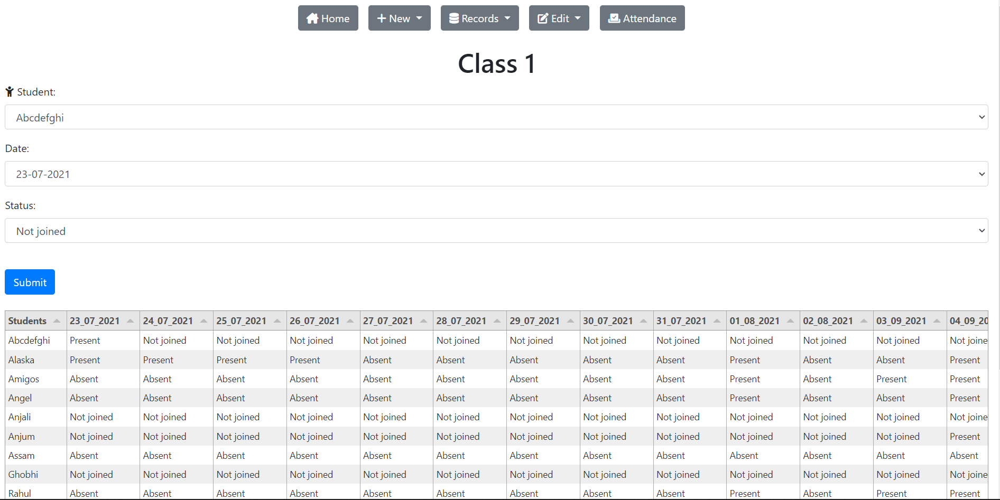

<h1 align="center">Paul Classes</h1>

- This a software made in order to manage attendance, give insightful data in the form of interactive graphs, manage student records, edit attendance/ student's records, etc.

## Technologies Used

### Languages

- JavaScript
- HTML
- CSS

### Frameworks

- Express JS
- Bootstrap
- Tabulator.JS
- Chart.JS

<h1 align="center">Features</h1>

## Detailed Analysis

- This software analyses all the information, and displays interesting useful graphs.

## Attendance Facility

- This software could also maintain attendance database automatically.

## Displays Interactive Tables

- A teacher would obviously have a need of getting the original data in tabular form.
- This application displays interactive tabular data 🙂

## Manages Student records

- In an educational institution, storing and managing student record's database can be quite a tedious and time-consuming task.
- This application does this work for you. all by its own

## Editing Attendance Records

- I very well understand that teachers can very well commit mistakes while entering attendance records, student's records, etc.
- So that is why this application has the flexibility of getting all the data entered by the user changed

## Facility To Create Unlimited Classes

- This application offers facility to create unlimited classes, whose database and records would get managed by the application automatically.

ThankYou 🙂💗